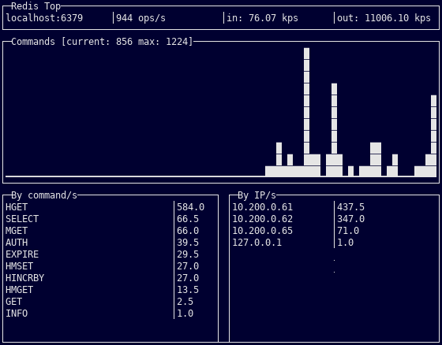

Redis Top
=========

Redistop uses [MONITOR](https://redis.io/commands/monitor) to watch Redis
commands and shows per command and per host statistics.

> Because MONITOR streams back all commands, its use comes at a cost.

Example
----

